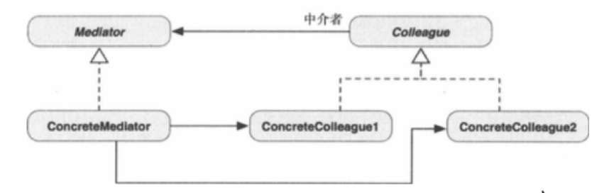

##1.中介者模式的引入
        为什么天上的飞机在飞行的时候，不会发生碰撞？
        是因为有一个集中的交通管制，它保证每架飞机都在雷达的监视之下，随时在
    屏幕上更新其飞行信息。天上或地面的飞行员都知道彼此的意图和位置，即使在降
    落时，每个飞行员都要向控制中心请求许可才能着陆。在这里，空中交通管制中心
    起着重要的协调作用，确保不会因秩序混乱或沟通不良导致飞机在空中相撞。
        而这一空中交通管制中心，称为中介者，在设计模式中被称为中介者模式。
##2.中介者模式
        中介者模式：用一个对象来封装一些列对象的交互方式，中介者使各对象不需
    要显示地相互引用，从而使其耦合松散，而且可以独立地改变它们之间的交互。
        面向对象的设计鼓励把行为分散到不同对象中。这种分送可能导致对象之间的
    相互关联。虽然把行为分散到不同对象增强了可复用性，但是增加的相互关联又减少
    获得的益处。增加的关联使得对象很难或不能在不依赖其他对象的情况下工作。应用
    程序的整体行为可能难以进行任何重大修改，因为行为分布于许多对象，于是结果可
    能是创建越来越多的子类，以支持引用的任何新行为；
        中介者模式用于定义一个集中的场所，对象间的教诲可以在一个中介者对象中
    处理。其他对象不必彼此交互，因此减少了他们之间的依存关系；
##3.中介者模式的类图

    
        抽象的Mediator定义了用于同Colleague交互的一般行为。典型的同事（
    colleague）是以明确定义的方式进行相互通信的对象，并彼此紧密依存。Concr
    eteMediator为Concrete Colleague定义了更加具体的行为。因此可以子类化
    Mediator，把各种Colleague交互算法应用到相同或不同的Colleague类型。
    如果应用程序只需要一个中介者，有事抽象的Mediator可以省略。
##4.何时使用中介者模式
        在一下情形，可以使用中介者模式：
        ① 对象间的相互虽定义明确然而非常复杂，导致一组对象彼此相互依赖而且
    难以理解；
        ② 因为对象引用了许多其他对象并与其通讯，导致对象难以复用；
        ③ 想要定制一个分布在多个类中的逻辑或行为，又不想生成太多的子类。
##5.例子
        ① 一个普通的中介者模式：Mediator
        ② 使用中介者模式控制UI视图的切换：MediatorUI