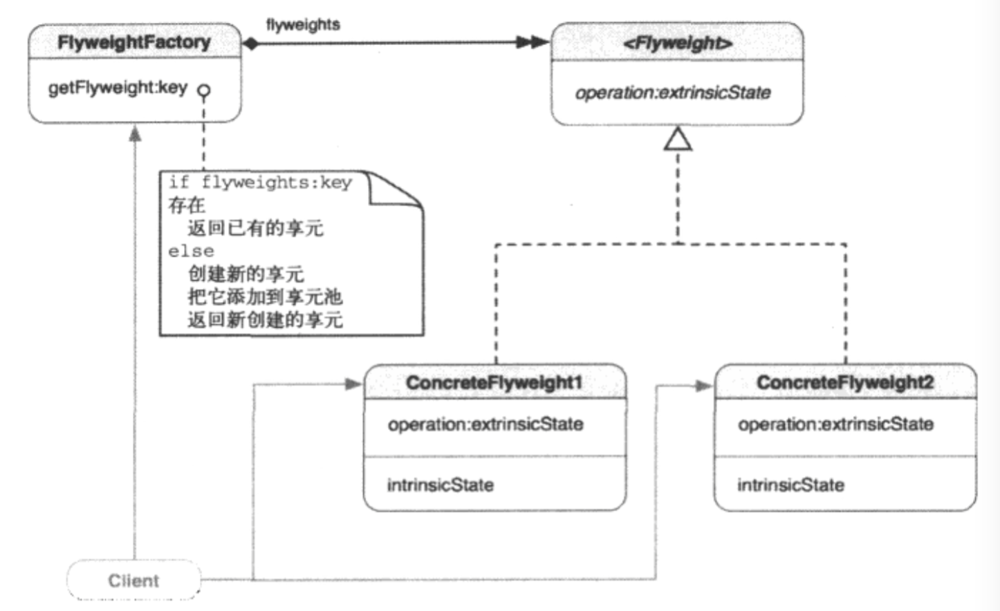

##1.享元模式的引入
        以公共厕所为例，人离不开厕所，而大街上也不能到处都有厕所，此时，公共厕
    所的重要性就体现出来了，公共厕所不仅解决了人的生理问题，而且还避免了厕所的
    空间占用问题。
        在面向对象中，利用公共对象不仅能节省资源，还能提高性能。而专门利用设计
    可共享对象的一种设计模式叫做享元模式。
##2.享元模式
        运用共享技术有效地支持大量细粒度的对象。
##3.享元模式的类图

        FlyWeight是两个具体享元类ConcreteFlyweight1和ConcreteFlyweight2
    的父类（协议）。每个ConcreteFlyweight类维护不能用于识别对象的内在状态
    instrinsicState。Flyweight声明了operation:extrinsicSate方法，由这两
    个ConcreteFlyweight类事项。instrinsicSate是享元对象中可被共享的部分，
    而extrinsicState补充缺少的信息。让享元对象唯一。客户端向operation:消息提
    供extrinsicState，让享元对象使用extrinsicState中的独一无二的信息完成任
    务。
##4.何时使用享元模式
        当遇到以下情形时，可使用享元模式：
        ① 应用程序使用很多对象；
        ② 在内存中保存对象会印象内存性能；
        ③ 对象的多数特有状态（外在状态）可以放到外部而轻量化；
        ④ 移除了外在状态后，可以用较少的共享对象提到原来的那组对象；
        ⑤ 应用程序不依赖于对象标示，因为共享对象不能提供唯一的标示；
##5.举例
        在屏幕上随处展示花朵，但实际上只是用了6个不同的花朵视图的实例。
