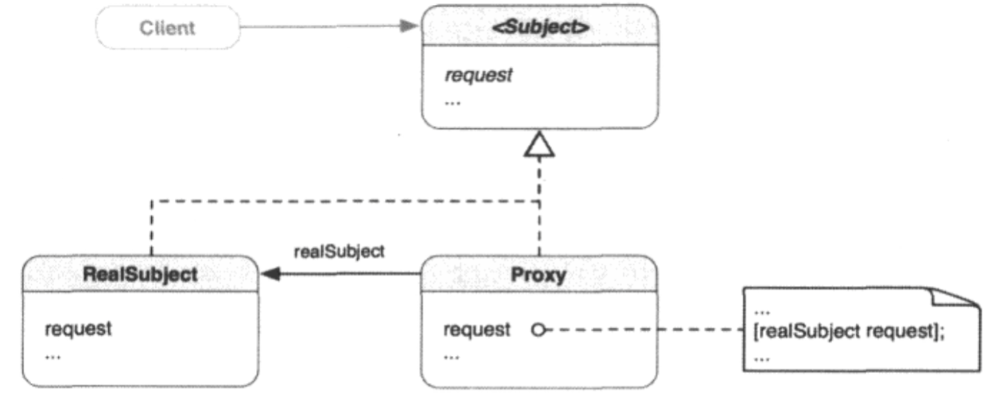

##1.代理模式的引入
        相信大家都买过火车票，而如果抢不到票，首先想到的就是黄牛，因为黄牛可以
    买到火车票；而这里的黄牛其实就是代理。
        在面向对象中，这一思想细化而来的设计模式叫做代理模式。
##2.代理模式
        为其他对象提供一种代理以控制对这个对象的访问。
##3.代理的分类
        ① 远程代理：为位于不同地址空间或网络上的对象提供本地代表；
        ② 虚拟代理：根据需要创建重型对象；
        ③ 保护代理：根据各种访问权限控制对原对象的访问；
        ④ 智能引用代理：通过对真正对象的引用进行计数来管理内存。也用于锁定真正
    对象，让其他对象不能对其进行修改。
##4.代理模式的类图

        代理模式的思想是使用一个基本跟实体对象行为相同的代理。客户端可以“透明
    的”使用代理，即不必知悉所面对的只是一个代理而不是实体对象。当客户端请求某些
    创建的开销大的功能时，代理将把请求发给实体对象，准备好请求的功能并返回给客户
    端。客户端不知道幕后发生了什么。代理和实体对象同样拥有客户端要求的行为。
        当客户端向Proxy对象发送request消息时，Proxy对象会吧这个消息转发给
    Proxy对象之中的RealSubject对象。RealSubject会实施实际的操作间接满足客户
    端的请求。
##5.何时使用代理模式
        在一下情形，可以使用代理模式：
        ① 需要一个远程代理，为位于不同地址空间或网络中的对象提供本地代表；
        ② 需要一个远程代理，来根据要求创建重型的对象；
        ③ 需要一个保护代理，来根据不同访问权限控制对原对象的访问；
        ④ 需要一个只能引用代理，通过对实体对象的引用进行计数来管理内存，也能用
    于锁定实体对象，让其他对象不能修改它。
##6.例子：
        ① 使用Cocoa中的代理与协议；
        ② 自定义实现Cocoa中的代理；