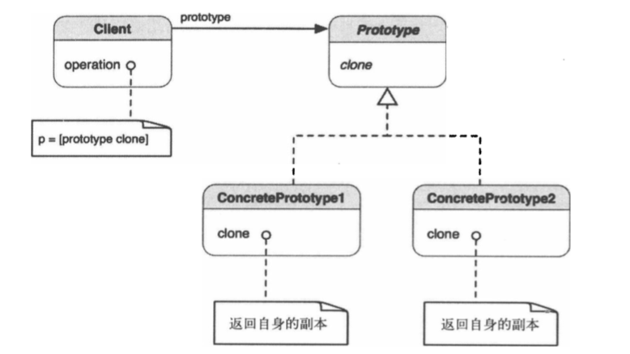

##1.原型模式的引入
        在应用程序中，有些对象的创建的代价过大或过于复杂。要是可以重建相同
    的对象并作细微的改动，事情会变得容易很多。典型的例子就是复制组合结构（比
    如树形结构）。从零开始构建一个树形结构组合体非常困难，我们可以通过轻微的
    改动重用已有的对象，以适应程序中的特定状况。
##2.原型模式
        使用原型实例指定创建对象的种类，并通过复制这个原型创建新的对象。
##3.原型模式的类图

        客户端知道Prototype类，在运行时，抽象Prototype子类的任何对象都
    可以按照客户端的意愿被复制。因此，无需手工创建就可以制造用一个类型的多个
    实例。
        Prototype声明了复制自身的接口。作为Prototype的子类，Concrete
    Prototype实现了Concrete复制自身的操作，这里的客户端通过请求原型复制其
    自身，创建一个新的对象。
##4.合适使用原型模式
        在一下情况下，会考虑使用原型模式：
        ① 需要创建的对象应独立于其类型与创建方式；
        ② 要实例化的类是在运行时决定的；
        ③ 不想要与产品层次相对应的工厂层次；
        ④ 不同类的实例间的差异仅是状态的若干组合。因此复制相应数量的原型比
    手工实例化更加方便；
        ⑤ 类不容易创建，比如每个组件可把其他组件作为子节点的组合对象。复制
    已有的组合对象并对副本进行修改会更加容易。
##5.Cocoa框架中的原型模式
        对象的copy/mutableCopy，就是原型模式的一种实现，使用copy，可以
    创建出一个原来对象的副本。
##6.总结
        我在本节中给出了两个例子
        ① 原型模式：PrototypeMode
        ② 使用copy实现原型模式：NSCopyDemo