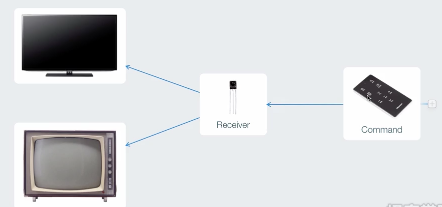
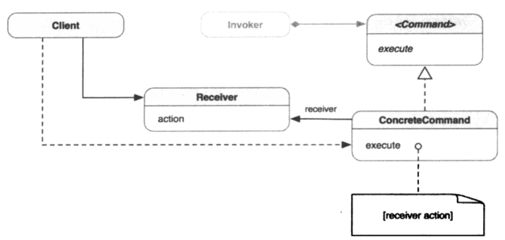

##1.命令模式的引入

    
        以遥控器控制电视为例，电视机的遥控器是可以共用的，是因为每台电视机都有
    一个信号接收器，它接受到遥控器传递过来的命令，然后执行操作，而遥控器只需要
    发出命令。
        在面向对象中，我们借用类似的思想，根据这一思想设计而来的设计模式就是命
    令模式。
##2.命令模式
        将请求封装为对象，从而可用不同的请求对客户端进行参数化，对请求排队或记
    录请求日志，以及支持可撤销的操作。
##3.命令模式的类图

        命令对象封装了如何对目标执行指令的信息，因此客户端或调用者不必了解目标
    的任何信息，却仍可以对它执行任何已有操作。通过把请求封装成对象，客户端可以把
    它参数化并置入队列或日志中，也能够支持可嘲笑的操作。命令对象将一个或多个动作
    绑定到特定的接受器。命令模式消除了作为对象的动作和执行它的接收器之间的绑定。
        ① Client：客户端，创建ConcreteCommand对象并设定其receiver（接收
    器）；
        ② Invoker：要求通用命令（实际上是ConcreteCommand）实施请求；
        ③ Command：是为Invoker所知的通用接口（协议）；
        ④ ConcreteCommand：起Receiver和对它操作action之间的中间人作用；
        ⑤ Receiver：可以是随着由Command（ConcreteCommand）对象实施的相应
    请求，而执行实际操作的任何对象；
##4.何时使用命令模式
        在一下情形，可以使用命令模式：
        ① 想让应用程序支持撤销与恢复；
        ② 想用对象序列化一个动作以执行操作，并用不同命令对象来代替回调函数；
        ③ 想要在不同时刻对请求进行指定、排列和执行；
        ④ 想记录修改日志，这样在系统故障时，这些修改可在后来重做一遍；
        ⑤ 想让系统支持事务，事务封装了对数据的一系列修改，事务可以建模为命令
    对象。
##5.Cocoa Touch框架中的命令模式
        NSInvocation、NSUndoManager和“目标-动作”机制是框架中对命令模式的
    典型应用。

