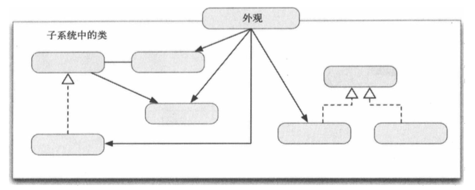

##1.外观模式的引入
        生活中处处充满了外观模式的例子；
        例如，你坐出租车去公司，只要出租车把你送到目的地，你不会在意车的牌子，
    型号，你只需要告诉司机目的地就行，然后出租车自己会执行一系列命令，把你送到
    目的地。
        出租车司机和你之间的接口只是一个简单的“到某地”的命令，并且这个命令不
    依赖于出租车的类型；
##2.外观模式
        外观模式：为系统中的一组接口提供一个统一的接口。外观定义一个高层接口，
    让子系统更易于使用；
##2.外观模式的类结构图

        子系统中有一组不同的类，其中一些彼此依赖，这让客户端难以使用子系统中的
    类，因为客户端需要知道每一个类，有事如果客户端只是需要其默认行为而不做定制，
    这会是不必要的麻烦，外观起到整个子系统的入口作用，有事客户端只需要子系统的
    某些基本行为，而对子系统的类不做太多定制，外观为这样的客户端提供简化的接口。
##3.何时使用外观模式
        在一下情形，可使用外观模式
        ① 子系统正逐渐变得复杂，应用模式的过程中演化出许多类。可以使用外观为
    这些子系统类提供一个较简单的接口。
        ② 可以使用外观对子系统进行分层。每个子系统级别有一个外观作为入口点，
    让它们通过其外观进行通信，可以简化它们的依赖关系；
