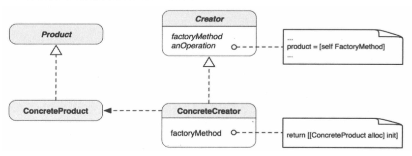

##1.工厂方法的引入
        以一个生产手机的例子为例；
        ① 手机都需要从工厂中生产；
        ② 手机又因为不同的系统，分为android手机、iPhone手机；
        ③ 不同系统的手机，不要在不同的工厂生产，android手机在android
    工厂，iPhone手机在苹果工厂；
        而这里就使用了工厂方法：
        ① 有一个抽象的手机类，该类里面声明了手机的基本功能，如打电话，发
    短信等；
        ② 有一个抽象的工厂类，该类里面声明了工厂的功能，就是生产手机；
        ③ 有两个具体具体的手机类，android手机类，iPhone手机类，两个手
    机都实现了手机的基本功能，但是因为系统的不同，二者具体的实现不同；
        ④ 有两个具体的工厂类，android工厂类，iPhone工厂类，两个工厂类
    都实现了工厂的基本方法，android工厂类生产android手机，iPhone工厂类
    生产iPhone手机；
        ⑤ 想得到哪种手机，就使用哪种工厂去生产；
##2.工厂方法
        工厂方法也称为虚构造器；
        它定义创建对象的几口，让子类决定实例化哪一个类，工厂方法使得一个类
    的实例化延迟到其子类；
##3.工厂方法的静态类结构

        抽象Product（产品）定义了工厂方法创建的对象的接口，ConcreteProd
    uct实现了Product的接口。Creator定义了返回Product对象的工厂方法。它
    也可以为工厂方法定义一个默认实现，返回默认Product对象。Creator的其他
    操作可以调用此工厂方法创建Product对象。ConcreteCreator是Creator的
    子类。它重载了工厂方法，以返回ConcreteProduct的实例。
##4.何时使用工厂方法
        遇到一下情形，你自然会想到工厂方法模式：
        ① 编译时无法准确预期要创建的对象的类；
        ② 类想让其子类决定在运行时创建什么；
        ③ 类有若干辅助类为其子类，而你想将返回哪一个子类这一信息局部化；
        使用这一模式的最低限度是，工厂方法能给予类在变更返回哪一种对象这一点
    上更多的灵活性；
##5.Cocoa框架中的工厂方法
        Cocoa Touch框架中的最常见的例子是NSNumbe；例如[NSNumber number
    WithBool:YES]消息会得到NSNumber的一个子类NSCFBoolean的一个实例。这个
    实例包含传给类工厂方法的布尔值。
##6.工厂方法的变体
        工厂方法有一个变体，抽象用它自己来生成子类。NSNumber中的这些number
    With*方法就是这个变体的例子。他们不是用来被NSNumber的私有子类重载的，而
    是NSNumber创建合适对象的便利方式。就NSNumber而言，没有可在别处生成的其
    他“数字生成器”，而是在类中提供了方法以达到类似的效果。它们被称为类工厂方法。
##7.总结
        工厂方法是面向对象软件设计中应用非常普遍的设计模式；
        我在这里给出了两个例子：
        ① 工厂方法：FactoryMethod
        ② 类工厂方法：SimpleFactory