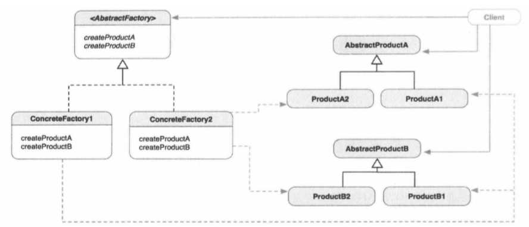

##1.抽象工厂的引入
        以手机-手表套装的生成为例；
        ① 手机-手表套装，需要一个工厂生产，该工厂既生成手机，又生成手表；
        ② 手机根据系统的不同，分为android手机，iPhone手机；
        ③ 手表与手机相对应，也分为android手表，iPhone手表；
        ④ 不同的手机、手表，也需要不同的工厂，android工厂生产android手
    机、手表，iPhone工厂生产iPhone手机、手表；
        在这里就使用了抽象工厂模式：
        ① 有一个抽象的手机类，该类里面声明了手机的基本功能，如打电话、发
    短信等；
        ② 有一个抽象的手表类，该类里面声明了手表的基本功能，如显示时间等；
        ③ 有一个抽象的工厂类，该类里面声明工厂的功能，生成手机、生成手表；
        ④ 有两个具体的手机类，android手机类，iPhone手机类，两个手机都实
    现了手机的基本功能，但是系统的不同，执行的结果也不同；
        ⑤ 有两个具体的手表类，android手表类，iPhone手表类，两个手表都实
    现了手表的基本功能，但是系统的不同，执行的结果不同；
        ⑥ 有两个具体的工厂类，android工厂类，iPhone工厂类，两个工厂类都
    实现了工厂的基本方法，但是具体的实现过程不同，android工厂生产android
    手机和手表，iPhone工厂生产iPhone手机和手表；
        ⑦ 想得到那种手机-手表套装，就使用那种工厂去生产。

##2.抽象工厂
        它提供了一个创建一系列相关或相互依赖对象的接口，而无需指定他们具体的
    类。
##3.抽象工厂的类图

##4.抽象工厂与工厂方法
        抽象工厂与工厂方法在许多方面都非常相似，很多人常常搞不清应该在什么时
    候用哪一个。两个模式都用于相同的目的：创建对象而不让客户端知晓返回了什么确
    切的具体对象。一下为抽象工厂模式与工厂方法的对比；
