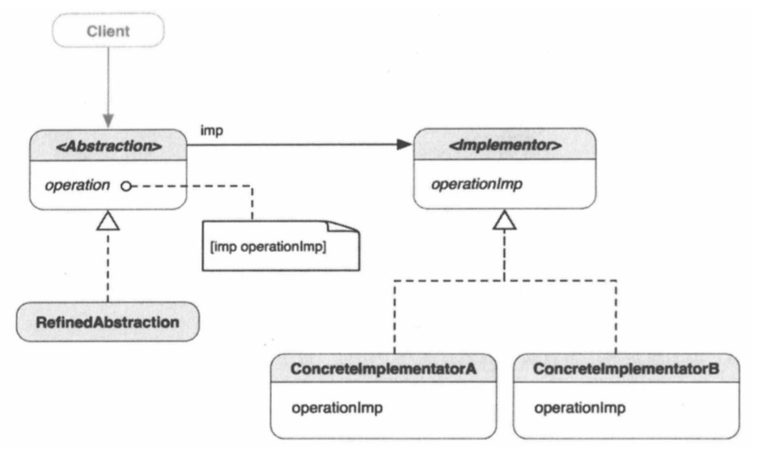

##1.桥接模式的引入
        以遥控器控制电视为例：
        每台电视都带有一个遥控器，用户可以用遥控器进行切换频道，这里遥控器是
    控制电视机的接口。如果每个电视机都需要一个专用的遥控器，那么但是遥控器就会
    导致设计激增。不过每个遥控器都有一些功能是各个电视机共有的，比如切换频道、
    调节音量和电源开关等。而且每台电视机都能通过基本命令接口，响应遥控器发来的
    这些指令。为解决这个问题，我们可以把遥控器逻辑同实际的电视分离开来。这样电
    视机的改变就不会对遥控器的设计有任何影响。
        而这里就用到了桥接模式；
        ① 首先由一个抽象的遥控器类，与一个抽象的电视机类，这两个类相互关联，
    这个电视机类可以相应遥控器类的所有命令；其中包括一些最基础的命令，有切换
    频道、调节音量、电源开关等等；
        ② 每创建一台具体的电视机类，电视机都只需实现自己有的命令，而不需要
    关心电视机；
        ③ 每创建一个遥控器，遥控器都只需发出这些命令，具体的命令由电视机去
    实现，而不关心命令的具体实现过程；
        ④ 这样，电视机的改变不会对遥控器的设计有任何影响，遥控器的设计，也
    不会影响其他电视机的型号。
##2.桥接模式
        桥接模式：将抽象部分与他的实现部分分离，使它们都可以独立地变化。
        桥接模式的目的是把对象层次结构从其实现中分离出来，使其能够独立变更。
    抽象层定义了供客户端使用的上层的抽象接口。实现层次结构定义了供抽象层次
    使用的底层的接口。实现类的引用被封装于抽象层的实例中时，桥接就形成了。
##3.桥接模式的类结构图

        Abstraction是定义了供客户端使用的上层抽象接口的父接口。它有一个对
    Implementor实例的引用，Implementor定义了实现类的接口。这个接口不必跟
    Abstraction的接口一致。Implementor的接口提供基本操作，而Abstraction
    的上层操作基于这些基本操作。当客户端想Abstraction的实例发送operation
    消息时，这个方法向imp发送operationImp消息，底下的实际ConcreteImpleme
    ntor（A或B）将作出相应并接受任务。
        因此想要往系统中添加新的ConcreteImplementator时，所要做的只是为
    Implementor创建一个新的实现类，响应operationImp消息并在其中执行任何具
    体的操作。不过，这对Abstraction方面不会有任何影响。同样，如果想修改Abst
    raction的接口或者创建更细化的Abstraction类，也能做到不影响桥接的另一头。
##4.何时使用桥接模式
        在一下情形，可使用桥接模式：
        ① 不想在抽象与其实现之间形成固定的绑定关系（这样能在运行时切换实现）；
        ② 抽象及其实现都应可以通过子类化独立进行扩展；
        ③ 对抽象的实现进行修改不应影响客户端代码；
        ④ 如果每个实现需要额外的子类以细化抽象，则说明有必要把它们分成两个部
    分；
        ⑤ 想在带有不同抽象接口的多个对象之间共享一个实现。