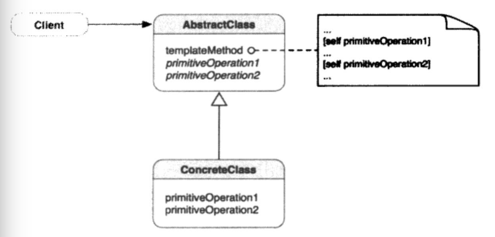

##1.模板方法的引入
        以生活中的烹饪为例，烹饪有特定的步骤，如准备食材、烹饪食材、上餐。实际
    食谱的每个步骤，都包含在其范围之内。而每种美食，所不同的是，准备的食材不同，
    烹饪的方法不同，以及上餐要注意的也不同。但是所有的食物在制作中，仍然基本上
    依照一般步骤。
        而烹饪的一般化步骤，就是一个模板方法。
##2.模板方法模式
        定义一个操作中算法的骨架，而将一些步骤延迟到子类中。模板方法使子类可以
    重定义算法的某些特定步骤而不改变算法的结构。
##3.模板方法的类图

        AbstractClass不完整的定义了一些方法与算法，留出一些操作未作定义。
    AbstractClass调用templateMethod时，方法中未定义的空白部分，有Concrete
    -Class重载primitiveOperations1来填补。
##4.何时使用模板方法
        在一下情形，可以使用模板方法：
        ① 需要一次性实现算法的不变部分，并将可变的行为留给子类来实现；
        ② 子类的共同行为应该被提取出来放到公共类中，以避免代码重复。现有代码的
    差别应该被分离为新的操作，然后用一个调用这些新操作的模板方法来替换这些不同的
    代码；
        ③ 需要控制子类的扩展。可以定义一个在特定点调用“钩子”操作的模板方法。子
    类可以通过对钩子操作的实现在这些点扩展功能。
##5.模板方法与委托的比较
        模板方法和委托模式常见于Cocoa Touch框架中，它们对框架类设计来说是非常
    自然的选择。为什么呢？用户应用程序可以复用框架类，而且框架类在设计时不会知道
    什么样的类会使用它们，可以对于特定的软件设计问题应该使用哪一个模式呢？
模板方法|委托模式
-------|-------
父类定义一个一般算法，但缺少某些特定/可选  的信息或算法，它通过这些缺少的信息或算法起  到一个算法“食谱”的作用|委托模式与预先定义好的委托接口一起定义  一个特定算法
缺少的信息由子类通过继承提供|特定算法由任何对象通过对象组合来提供
    