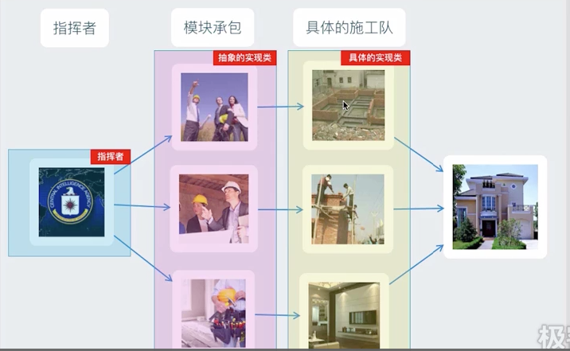
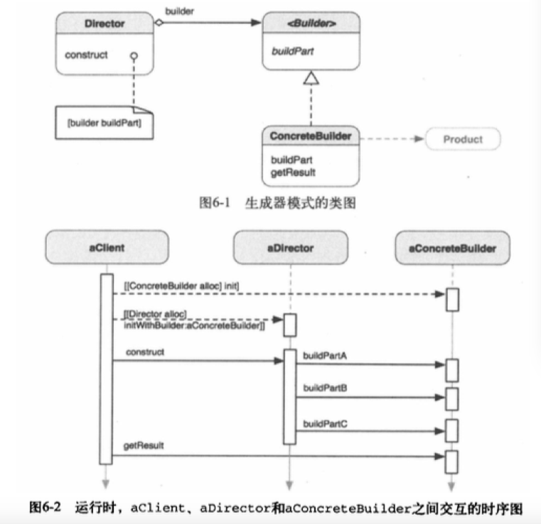

##1.生成器模式的引入
        以建造房子为例：

        我们在建造房子时，我们会设计好房子的样式，然后把房子的样式交给建筑公
    司，建筑公司（指挥者）会把工作承包给几个承包商，而各个承包商会去找施工队
    去完成建筑的任务，最后建出房子；
        而这里就用到了生成器模式：
        ① 客户端设计出房子的风格、样式，并传给指挥者；
        ② 指挥者类根据要求，创建出承包商类；
        ③ 这里的承包商是抽象的，每个承包商都执行有各自的任务与特性；
        ④ 这里的施工队是具体的实现，实现了承包商类的功能；
        ⑤ 指挥者根据具体的承包商，创建出房子，完成创建任务；
##2.生成器模式
        将一个复杂对象的构建与他的表现分离，使得同样的构建过程可以创建不同的
    表现；
##3.生成器模式的类图

        
        除了客户和产品，生成器模式还有两个重要的角色：Director（指导者）和
    Builder（生成器）。Builder知道如何在缺少某些特定信息的情况下建造产品，
    Director知道Builder应该建造什么，以向Builder提供参数来建造特定产品。
        Builder是一个抽象接口，声明了一个builPart方法，该方法由Concrete
    Builder实现，以构造产品（Product）。ConcreteBuilder有一个getResult
    方法，向客户端返回构造完毕的Product。Director定义了一个construct方法，
    命令Builder的实例去buildPart。Director和Builder形成了一种聚合关系，
    这意味着Builder是一个组成部分，与Director结合，以使整个模式运转，但同时
    Director并不负责Builder的生存期。
##4.生成器模式的使用
        在一下情形，可以使用生成器模式：
        ① 需要创建涉及各种部件的复杂对象，创建对象的算法应该独立于部件的装配
    方式。常见的例子是构建组合对象。
        ② 构建过程需要一不同的方式（例如，部件或表现的不同组合）构建对象；
##5.生成器模式与抽象工厂的对比
        抽象工厂与生成器模式在抽象对象创建方面有很多相似的之处，然而，二者大不
    相同。一方面，生成器关注的是分步创建复杂对象，很多时候同一类型的对象可以以
    不同的方式创建；另一方面，抽象工厂的重点在于创建简单或复杂产品的套件。生成
    器在多步创建过程的最后一步返回产品，而抽象工厂则立即返回产品。
        下表是二者的主要差异
生成器|抽象工厂
-----|-----
构建复杂对象|构建简单或复杂对象
以多个步骤构建对象|以单一步骤构建对象
以多种方式构建对象|以单一方式构建对象
在构建过程的最后一步返回产品|立刻返回产品
专注一个特定产品|强调一套产品
