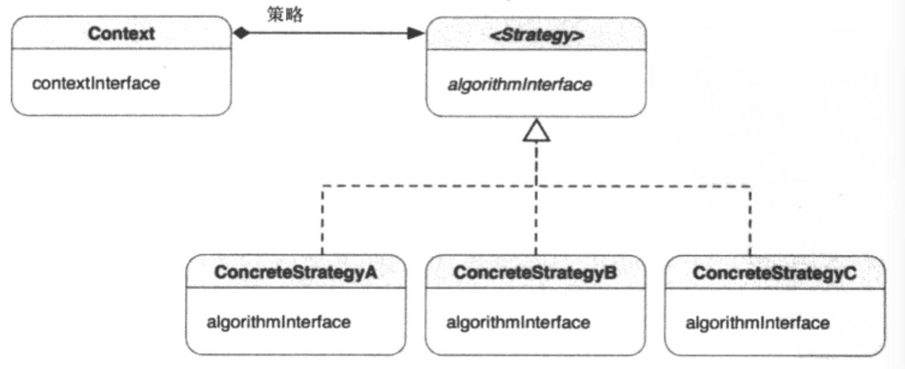

##1.策略模式的引入
        在开发中常有这样的情形：把一堆算法塞到同一段代码中，然后使用if-else或
    条件语句来决定使用哪个算法？这些算法可能是一堆相似的类函数或方法，用以解决
    相关的问题。例如，我有一个验证输入数据的例子，数据本身可以是任何数据类型（
    如CGFloat，NSString，等）。每种数据需要不同的验证算法。如果能把每个算法
    封装成一个对象，那么就能消除根据数据类型决定使用什么算法的一堆if-else语句。
        面向对象中，我们可以把相关的算法分离成不同的类，成为策略。与这种做法相
    关的一种设计模式称为策略模式。
##2.策略模式
        定义一系列算法，把他们一个个封装起来，并且使他们可相互替换。本模式使得
    算法可独立于使用它的客户而变化。
##3.策略模式的类图

        策略模式的一个关键角色是策略类，它为所有支持的或相关的算法声明了一个共
    同的接口，另外使用策略接口来实现相关算法的具体策略类。场景类（Context）的
    对象配置有一个具体策略类的实例，场景对象使用策略接口调用由具体策略类定义的
    算法。
        一组算法，或者说算法的一个层次接口，以ConcreteStrategy（A、B、C）类
    的形式，共享相同的algorithmInterface接口，这样Context就能使用相同的接口
    方位算法的各种变体。
##4.何时使用策略模式
        在一下情形，可以使用这一模式：
        ① 一个类在其操作中使用多个条件语句来定义许多行为，我们可以把相关的条件
    分支移到他们自己的策略类中；
        ② 需要算法的各种变体；
        ③ 需要避免吧复杂的、与算法相关的数据结构暴露给客户端。