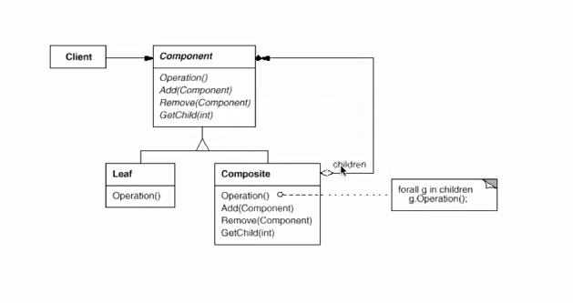

##1.组合模式的引入
        每个人的家族就是一个组合，这个组合包括了家族的所有人，从祖先到最后的
    一代所有人，这一组合类似一个树形结构，而每个人就是这棵树上的一个节点；如果
    想让家族的所有人做某件事，就需要用到组合模式；
##2.组合模式
        组合模式：将对象组合成树形结构以表示“部分-整体”的层次结构。组合使得
    用户对单个对象和组合对象的使用具有一致性；
        组合模式让我们把相同类型的对象组合到树状结构中，其中父节点包含同类型的
    子节点。换句话说，这种树状结构形成“部分-整体”的层次结构。什么是“部分-整体”
    的层次结构呢？它既是包含对象的组合（容器）又包含作为叶节点（基元）的单个对象
    的一种层次结构。每个组合体包含的其他节点，可以是叶节点或者是其他组合体。这种  
    关系在这个层次结构中递归重复。因为每个组合或叶节点有相同的基类型，同样的操作
    可用于它们中的每一个，而不必在客户端做类型检查。客户端对组合和叶节点进行操作
    时可以忽略它们之间的差别。
##3.组合模式的类图

        基接口定义了Leaf类和Composite类共同的操作的Component。
        有些操作只对Composite类有意义，比如add:Component、remove:Compon
    ent等。Leaf类不实现这些方法（其实做了空实现）；之所以不把这些方法放到Compo
    site中，是因为我们不想让客户端在运行时知道他们在处理哪种类型的节点，也不想
    把组合结构的内部细节暴露给客户端。这样做可以让客户端对它们统一处理。
        每个节点代表一个叶节点或组合节点。Leaf节点和Composite节点的主要区别
    在于，Leaf节点不包含同类型的子节点，而Composite则包含。Composite包含同
    一基类型的子节点。由于Leaf类与Composite类有同样的接口，任何对Component
    类型的操作也能安全地应用到Leaf和Composite。客户端不必理会那一连串用来判定
    被处理的对象的确切类型的if-else或swtich-case语句。
        在层次结构的最顶层，这些节点的祖先节点被当做Component类的实例的引用来
    对待。如果内部结构有任何的变更，客户端代码都不用作修改。
##4.何时使用组合模式
        在一下情形，可使用组合模式：
        ① 想获得对象抽象的树形结构（部分-整体层次结构）；
        ② 想让客户端统一处理组合结构中的所有对象。
