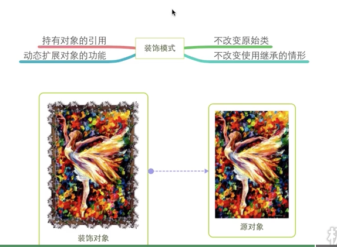
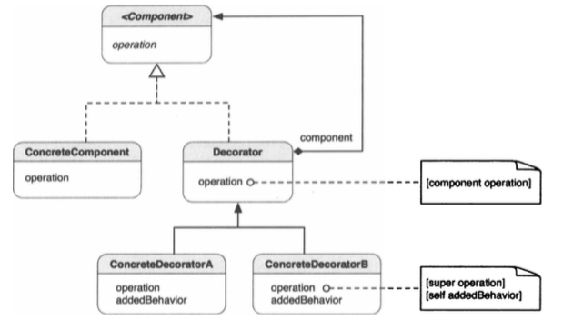

##1.装饰模式的引入

         通常我们在拍照之后，都会用一个相框把相片装起来，这样相片就更加方便我们
    摆设；而相框我们可以根据自己的爱好自由选择，而相片只有一张；我们不会为了一
    个相框重新去拍另一张照片。
        在面向对象中，我们借用了相同的思想，向对象添加“东西（行为）”，而不破坏
    其原有风格，因此增强了的对象是同一个类的加强版（带相框的照片）。任何的增强
    （装饰）都可以动态的添加或删除。把这一设计模式叫做“装饰”。
##2.装饰模式
        动态地给一个对象添加一些额外的职责，就扩展功能来说，装饰模式相比生成子类
    更为灵活。
##3.装饰模式的类图

        标准的装饰模式包括一个抽象Component父类，它为具体组件（component）声
    明一些操作。抽象的Component类可被细化为另一个叫做Decorator的抽象类，该类
    包含了另一个Component的引用。ConcreteDecorator为其他Component或
    Decorator定义了几个扩展行为。并且会在自己的操作中执行内嵌的Component操作。
        Component定义了一些抽象操作，其具体类将进行重载以实现自己特定的操作。
    Decorator是一个抽象类，他通过将一个Component内嵌到Decorator对象，定义了
    扩展这个Component的实例的“装饰性”行为。默认的operation方法只是向内嵌的
    component发送一个消息。ConcreteDecoratorA和ConcrDecoratorB重载父类
    的operation，通过super把自己增加的行为扩展给component的operation。
##4.何时使用装饰模式
        在一下情形，可以使用这一模式
        ① 想要下不影响其他对象的情况下，以动态、透明的方式给单个对象添加职责；
        ② 想要扩展一个类的行为，却做不到。类定义可能被隐藏，无法进行子类化；或
    者，对类的每个行为的扩展，为支持每种功能组合，将产生大量的子类；
        ③ 对类的职责的扩展是可选的。
##5.Objectivie-C中的装饰模式
        类别是一个Objectivie-C的语言功能，通过它可以向类添加行为（方法的实现和
    接口），而不必进行子类化。通过类别添加的方法对原有的方法没有不良影响。类别中的
    方法称为了类的一部分，并可由其子类继承。
        我们可以通过类别来实现装饰模式，然而，这并不是一种严格的实现，它实现了模式
    的意图，但却是一种变体。
