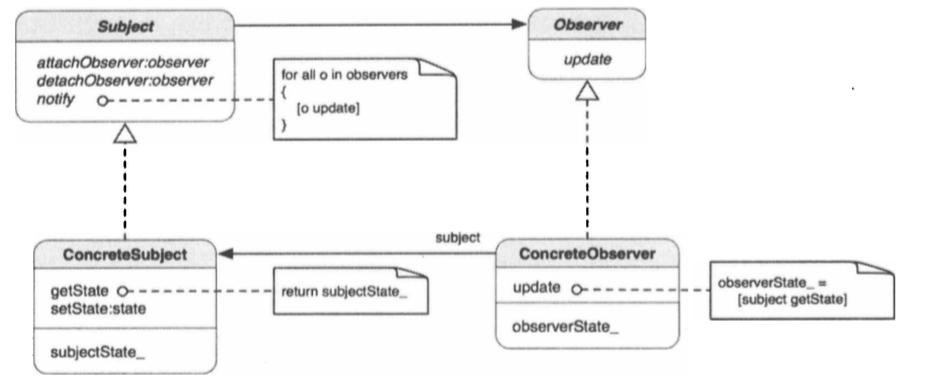

##1.观察者模式的引入

        以订阅杂志为例:
        当从杂志发行商订阅杂志的时候，读者会把名字和邮件地址提供给发行商，这样
    新的一期就能送到读者手上。发行商保证把正确的杂志送到正确的地址。一般来说，
    读者不会受到他没有订阅的杂志。
        这正是观察者模式的工作方式，观察者通过通知器（发行商）把自己注册到（
    订阅）特定的通知（杂志）。当有通知的时候，观察者只能从通知器得到它订阅的通
    知。
##2.观察者模式
        观察者模式：定义对象间的一种一对多的依赖关系，当一个对象的状态发生改变
    时，所有依赖于他的对象都得到通知并自动更新；
##3.观察者模式的类图

        观察者模式是一种发布-订阅模型。Observer从SubJect订阅通知，Concrete
    Observer实现抽象Observer并重载其update方法，一旦Subject的实例需要通知
    Observer任何新的变更，Subject会发送update消息来通知存储在内部列表中所有
    注册的Observer。在ConcreteObserver的update方法的实际实现中，Subject
    的内部状态可被取得并在以后进行处理。
        Subject提供注册与取消注册的方法，任何实现了Observer协议而且想要处理
    update消息的对象，都可以进行注册或取消注册。当Subject的实例发生变更时，他
    回想自己发送nofiy消息，notify方法里有一个算法，定义了如何向已注册的观察者
    广播update消息；
##4.运行时通知-更新时序图

        aConcreteObserver首先修改aConcreteSubject的状态，因为内部状态发生
    了变化，aConcreteSubject向自己发送一个notify消息，以便想一组aConcrete
    Observer广播update消息。aConcreteObserver和anotherConcreteObserver
    收到消息，然后向aConcreteSubject发送getState消息，以取得其内部状态进行
    进一步处理。
##5.何时使用观察者模式
        在一下情形，可使用观察者模式：
        ① 有两种抽象类型相互依赖，将他们封装在各自的对象中，就可以对他们单独进
    行改变和复用；
        ② 对一个对象的改变需要同时改变其他的对象，而不知道具体有多少对象有待改
    变；
        ③ 一个对象必须通知其他对象，而它又不需知道其他对象是什么。