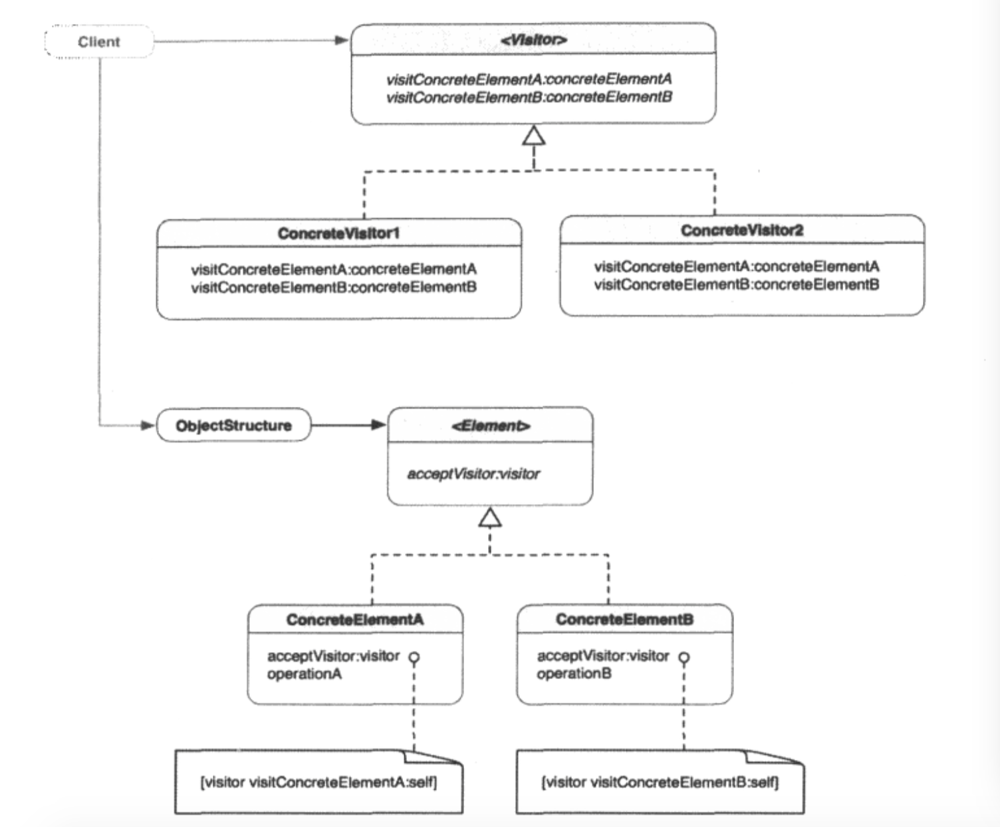

##1.访问者模式的引入
        以修水管为例，加入家里的水管坏了，而你自己又不会修。因此，解决这个问题最
    有效率的办法就是，尽快找工人来修。
        在软件设计中，如果为了扩展类的功能而往一个类中塞进了太多的方法，类就会变
    得极为复杂，更好的方法就是创建外部的类来扩展它，而对源代码不做太多改动。
        而这就是访问者模式。
##2.访问者模式
        访问者模式：表示一个作用于某对象结构中的各元素的操作。它让我们可以在不改
    变各元素的类的前提下定义作用于这些元素的新操作。
        访问者模式涉及两个关键角色（或者说组件）：访问者和它访问的元素。元素可以
    是任何对象，但通常是“部分-整体”结构中的节点。部分-整体结构包含组合体和叶节点
    ，或者任何其他复杂的对象结构。元素本身不仅限于这些种类的结构。访问者知道复杂
    结构中每个元素，可以访问每个元素的节点，并根据元素的特征、属性或操作执行任何
    操作。
##3.访问者模式的类图

        Visitor协议声明了两个很像的visit*方法，用于访问和处理各种Element类型
    的对象。ConcreteVisitor（1或2）实现这一协议及其抽象方法。visit*的操作定义
    了针对特定Element类型的适当操作。Client创建ConcreteVisit（1或2）对象，并
    将其传给Element对象结构。Element对象结构中有一个方法接受一般化得Visitor类
    型。继承Element的类中，所有acceptVisitor方法中的实际操作几乎一样，只有一条
    语句，让Visitor对象访问发起调用的具体Element对象。实际使用visit*消息，定义
    在每个具体Element类中，这是具体Element类之间的唯一不同之处。每当把acceptVi
    sitor:消息传给Element结构，这个消息就会被转发给每个节点，在运行时确定Eleme
    -nt对象的实际类型，再根据实际类型决定该调用哪个visit*方法。
##4.何时使用访问者模式
        在一下情形，可以使用访问者模式：
        ① 一个复杂的对象结构包含很多其他对象，它们有不同的接口（比如组合体），但
    是想对这些对象实施一下依赖于具体类型的操作；
        ② 需要对一个组合结构中的对象进行很多不想关的操作，但是不想让这些操作“污
    染”这些对象的类。可以将相关操作集中起来，定义在一个访问者类中，并在需要在访问
    这种定义的操作时使用它；
        ③ 定义复杂结构的类很少修改，但经常需要向其添加新的操作。