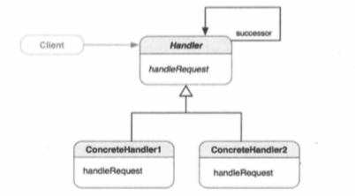

##1.责任链模式的引入
        以生产某个机器为例，在生产线上，每个工人都知道如何为传送带上未完成的产品
    安装特定的零件，但产品需要在装配线上沿着工人的“链条”传递，知道最后一名工人完
    成装配，产品才能出厂。生成线上每个工人都有自己的专长和职责，这样就形成了责任
    链。
        在软件开发中，把这种模式成为责任链模式。
##2.责任链模式
        使多个对象都有机会处理请求，从而避免请求的发送者和接收者之间发生耦合。此
    模式将这些对象连成一条链，并沿着这条链传递请求，知道有一个对象处理它为止。
##3.责任链模式的类图

        责任链模式的主要思想是，对象引用了同一类型的另一个对象，形成一条链，链中
    的每个对象实现了同样的方法，处理链中第一个对象发起的同一个请求。如果一个对象
    不知道如何处理请求，他就把它穿个下一个响应器（successor）。
        Handle是上层抽象，定义了一个方法handleRequest。处理它知道如何处理的
    请求对象。ConcreteHandle1和ConcreteHandle2实现了handleRequest方法，
    来处理它们认识的对象。Handle也有一个指向另一个同类型实例的引用，即succes
    sor。当调用Handle实例的handleRequest消息时，如果这个实例不知道如何处理
    请求，他会用同样的消息把请求转发给successor，如果successor可以处理，就行
    了；否则，它就把请求传递个下一个successor。这个过程会一个进行下去，直到请求
    被传到链中的最后一个Handle。
##4.何时使用责任链模式
        在一下情形，可以使用责任链模式：
        ① 有多个对象可以处理请求，而处理程序只有在运行时才能确定；
        ② 想一组对象发出请求，而不想显示指定处理请求的特定处理程序。