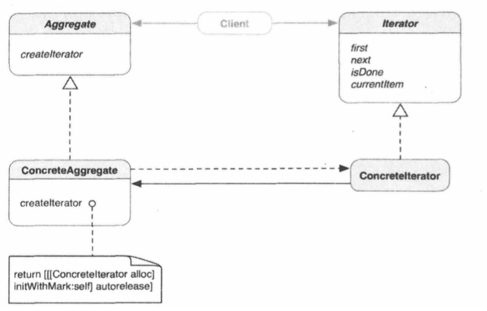

##1.迭代器模式的引入
        以自动售货机为例，售货机中放了一系列的汽水，顾客可以选择想要的汽水，售
    货机会从一堆汽水中取出一瓶，送出托盘；
        在售货机中，有一个内部货架，他的作用就是容纳了所有的汽水；
        其中也有一个分配器，它的作用就是取出其中的一瓶汽水；
        在面向对象中，这种针对抽象集合迭代行为的设计模式叫迭代器模式。
##2.迭代器模式
        迭代器模式：提供一种方法顺序访问一个聚合对象中各个原色，而又不许暴露
    该对象的内部表示；
        遍历集合中元素的职能从集合本身转移到迭代器对象。迭代器定义了一个用于
    访问集合元素并记录当前元素的接口。不同的迭代器可以执行不同的遍历策略。
##3.迭代器模式的类图   

        抽象的Aggregate定义了createIterator方法，它返回了一个Iterator对
    象。ConcreteAggregate对象子类化Aggregate，重载其createIterator方法
    并返回ConcreteIterator的实例。Iterator抽象类定义了所有的Iterator应具
    有的基本迭代行为。客户端会使用定义好的抽象接口来遍历任何Agregate类型对象
    中的元素；
##4.迭代器的分类
        基本上有两种迭代器：外部迭代器和内部迭代器。外部迭代器让客户端直接操作
    迭代过程，所以客户端需要知道外部迭代器才能使用。另一种是，集合对象（被迭代
    的目标对象）在其内部维护并才做一个外部迭代器，提供内部迭代器的典型的集合对
    象为客户端定义一个借口，或者从底层的集合一次访问一个元素，或者向每个元素发
    送消息，外部迭代器与内部迭代器的区别如下：
外部迭代器|内部迭代器
---------|--------
客户端需要知道外部迭代器才能使用，但  是他为客户端提供了更多的控制|客户端不需要知道任何外部迭代器，而是通过集合  对象的特殊接口，或者一次访问一个元素，或者向集合中  每个元素发送消息
客户端创建创建并维护外部迭代器|集合对象本身创建并维护它的外部迭代器
客户端可以使用不同外部迭代器实现多  中类型的遍历|集合对象可以在不修改客户端代码的情况下，选择不同  的外部迭代器
##5.何时使用迭代器模式
        在一下情形，可使用迭代器模式：
        ① 需要访问组合对象的内容，而又不暴露其内部表示；
        ② 需要通过多种方式遍历组合对象；
        ③ 需要提供一个统一的接口，用来遍历各种类型的组合对象；
##6.Cocoa框架中的迭代器模式
        苹果公司用自己的命名规则“枚举器/枚举”改写了迭代器模式，用于相关基础类
    的各种方法，基础框架中的NSEnumerator类实现了迭代器模式。抽象NSEnumerator
    类的私有具体他子类返回枚举器对象，能够顺序遍历各种集合--数组、集合、字典，把
    集合中的对象返回客户端。
