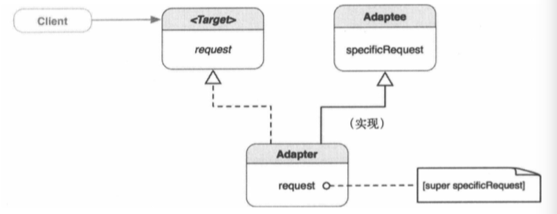
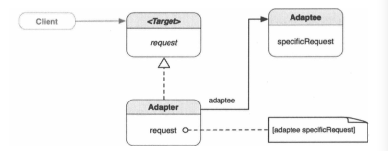

##1.适配器模式的引入
        以手机充电为例；
        在中国制造的手机，充电的电压是220v，但是如果带着手机到了国外，国外的
    电压不是220v，手机就不能充电了。此时如果在国外买一个手机，到了国内有会因
    为不能充电，手机又不能用了。为解决这个问题，每个手机都配了一个电源转换器，
    这个电源转换器支持100-220v的电压，手机在充电时，会把传入的电压转换为手机
    需要的电压，手机就不会因为电压的不同，而不能充电；
        而这个给手机充电的过程就使用了适配器模式；
        ① 手机端需要用特定的电压进行充电；
        ② 而电源端传入的电压大小不同；
        ③ 使用了电源转换器把传入的电压转换成了手机需要的电压；
##2.适配器模式
        适配器模式：将一个类的接口转换成客户希望的另外一个接口。适配器模式使得
    原本由于接口不兼容而不能一起工作的那些类可以一起工作。
        适配器模式，用于连接两种不同种类的对象，使其毫无问题的协同工作。有时它
    也被称为“包装器”。其思想相当简单，适配器实现客户端所要的某种接口的行为。同
    时，它又连接到另一个具有（完全）不同接口与行为的对象。一边是客户端懂得如何
    使用的目标接口，另一边是客户端一无所知的被适配者，适配器站在两者之间。适配
    器的主要作用是把被适配者的行为传递给管道另一端的客户端；
##3.适配器的类型
        基本上，有两种实现适配器的方式，
        ① 类适配器：通过继承来适配两个接口，这被称为类适配器；
        ② 对象适配器：与类适配器不同，对象适配器不继承被适配者，而是组合了一
    个对它的引用；
##4.类适配器的类图

        其中Target指目标接口，Adaptee指被适配者，request指请求；
        Adapter是一个Target类型，同时也是一个Adaptee类型。Adapter重载
    Target的request方法。但是Adater没有重载Adaptee的specificRequest
    方法，而是在Adapter的request方法实现中，调用超类的specificRequet方
    法。request方法在运行时向超类发送[super specificRequest]消息。super
    就是Adaptee，它在Adapter的request方法的作用域内，按自己的方式执行
    specificRequest方法。只有当Target是协议而不是类时，类适配器才能够用oc
    来实现；
##5.对象适配器的类图

        Target和Adapter之间的关系和类适配器中相同，而Adapter和Adaptee的
    关系从“属于”变成了“包含”，这种关系下，Adapter需要保持一个对Adaptee的
    引用。在request方法中，Adapter发送[adaptee specificRequest]消息给
    引用adaptee，以间接访问它的行为，然后实现客户端请求的其余部分。由于Adapter
    与Adaptee之间是一中“包含关系”，用Adapter去适配Adaptee的子类也没问题。
##6.类适配器与对象适配器的对比
        类适配器与对象适配器是实现适配器模式的不同方式，但是达成的目的相同，
    一下是二者的对比
类适配器|对象适配器
-------|-------
只针对单一的具体Adaptee类，把Adaptee适配到Target|可以适配多个Adaptee及其子类
易于重载Adaptee的行为，因为是通过直接的子类化进行的适配 |难以重载Adaptee的行为，需要借助于子类的对象而不是Adaptee本身
只有一个Adapter对象，无需额外的指针间接访问Adaptee| 需要额外的指针以间接访问Adaptee并适配其行为
##7.何时使用适配器模式
        在一下情形，可使用适配器模式
        ① 已有的接口与需求不匹配；
        ② 想要一个可复用的类，该类能够同可能带有不兼容接口的其他类协作；
        ③ 需要适配一个类的几个不同子类，可是让每一个子类去子类化一个类适配
    器又不现实。那么可以使用对象适配器（也叫委托）来适配其父类的接口。